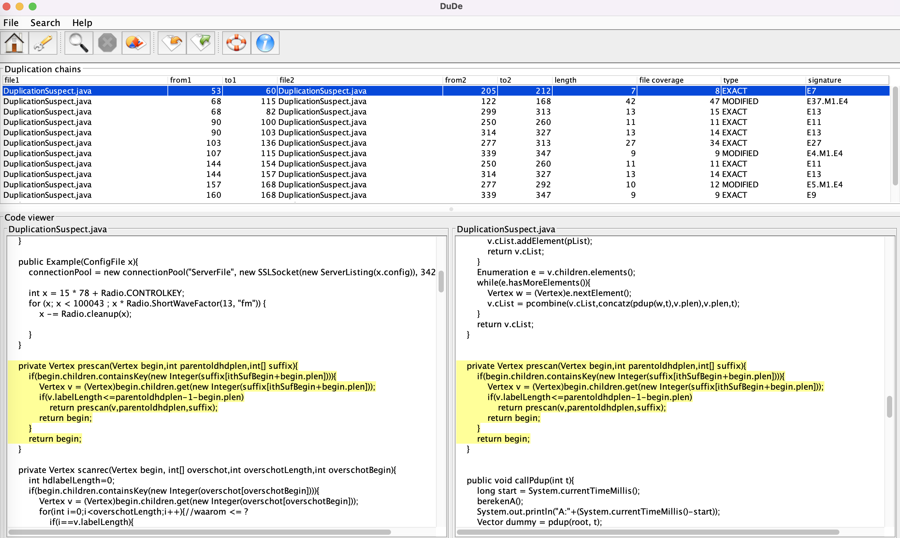

# Code Clones: Hands-on Lecture

This repository presents a practical lecture on using Code Clones Tools, for the Software Engineering course at the Loyola University Maryland. 

Just clone this repo as a zip file, and unpack the zip to have access to the source code inside. 

## Introduction

Duplicated code is a phenomena that could be as old as programming itself. It is easy to understand the appeal of duplicating code: it is fast and easy.

There are many disadvantages associated with the practice of cloning code as it makes maintenance more difficult by: (i) copying bugs, (ii) managing changes across duplicates, and (iii) hinders the understandability. 

Fowler and Beck have ranked duplicated code as the first of the top ten code smells indicating the need to refactor a piece of software.

## Task 1: Manual Code Clone Detection (10 min)

We start with the ultimate clone detector: the developer. Look at the folder `ShortCodeExample` and open the Java Class inside of it on your favorite IDE. Try to find pieces of code that seem to be closely related for about 10 minutes. 

**Questions**:
- Can you detect duplication with your bare eyes?
- Which methods seem to be similar?

> Main lesson: Manual clone detection does not scale very well. We will therefore use some tools to do the tedious comparisons.

## Task 2: Automated Small Scale Clone Detection (10 min)

Let's use an automated tool for duplicate detection, [Dude](http://wettel.github.io/dude.html). This tool uses line similarity to find clones. 
Now, we will use Dude to detect clones on the `ShortCodeExample/DuplicationSuspect.java` file. 

Download and execute Dude. Since it is a java executable, Dude should run on any platform with a JVM. On the main interface, click on the "Home/House" icon (or menu 'Search' -> 'Set starting directory') and select the folder with `ShortCodeExample`. Make sure there are no other files in this folder otherwise Dude will also try to detect clones on them. Then click on the 'Search' icon (or menu 'Search' -> 'Search').



**Questions:**
- How easy was it to use this tool?
- Did the tool detect more or fewer duplicates than you?
- Can you determine any refactoring candidates based on this tool output?

> Main lesson: Any laborious activity may be much better served by an automated tool. I am positive, this tool detected more clones than you did in much less time. Code clones are one of the major smells for refactoring, therefore, this tool could be very useful.

## Task 3: Customizing Small Scale Clone Detection (10 min)

Let's change some of the parameters on Dude, and see how that could affect the clone detection.

Click on the "Wrench" icon (or menu 'Search' -> 'Configure Parameters'). Change the 'Line Comparison Strategy' option to 'Tokenized Distance'. Moreover, make sure the Similarity Threshold is at 80%. After confirming the new configuration, click on the 'Search' icon again (or menu 'Search' -> 'Search'). 


**Questions:**
- By changing, the configuration, did the tool detect more clones?
- How is it different to set the parameters for exact matching (the default configuration) compared to other similarities? 

Try to change other parameters of DuDe and see how that affects the detected clones. The minimum size of the duplication chain (min SDC) is the threshold based on which Dude filters the insignificant results. The maximum line bias (max LB) is the maximum length of the gap that is allowed to link two consecutive exact chunks within a duplication chain. The minimum size of the exact chunk (min SEC) is the smallest size for an exact chain allowed to be part of a duplication chain.

> Main lesson: The configuration of your clone detection tool can greatly affect the number of detected clones. You must customize those parameters to better suit your project.

## Task 4: Large-Scale Clone Detection (10-20min)

Dude is a useful tool for small projects. However, for large codebases, its method may be too slow for practical usage (Dude's time complexity seems to be quadratic). Therefore, once our sources increase in size, we must choose tools that scale better for larger systems. 

Download the [FreeMercator](https://sourceforge.net/projects/freemercator/) source code. FreeMercator is a Point-of-Sales Application written in Java. It has approximately 67K lines of code (30K Java, 36K XML). If you try to run Dude on it, it will take about 15-30 minutes.

Let's try now a more sophisticated tool, called [iClones](http://www.softwareclones.org/iclones.php). The version we are using is free for personal and academic purposes. In the folder `Tools` on this repo, there are already zip files with iClones and its viewer (RCFViewer). Be sure to use the tools on this repository (the professor made some changes for it to run more easily). These are command line tools, and we will need to use the Terminal/Prompt. The commands are for Mac/Unix, and you must adapt appropriately for Windows (ex.: change '/' on the path for '\', instead of ".sh" use ".bat", etc.).

Create a folder anywhere on your computer, and place the folders for iClones, rcfviewer, and freemercator inside of it. 

```
    .                        # My folder for this task
    ├── freemercator             # Unpacked Freemercator source codes
    ├── iclones-0.2              # Unpacked iClones
    └── rcfviewer-0.2            # Unpacked RCFViewer
```

All the commands will assume you are using this exact same folder structure and names. I strongly suggest you follow this exact same structure and do not change it, as it may affect the display of the clones (this tool is very temperamental). 

Open a terminal/prompt and set freemercator as your current folder. Now, let's run iClones with the following command:
```
../iclones-0.2/iclones -input . -output clonereport.rcf -outformat rcf
```

That will create a file called 'clonereport.rcf' which contains all the clones detected by iClones. To see these clones in a more user-friendly interface, we need to use the rcfViewer. But first, we need to configure rcfViewer to our environment, as it uses the SWT library for its interface. By running rcfViewer it will try to automatically use the copy and use the correct library. Run the command (change 'sh' to 'bat' on Windows) and see if you get an empty interface:
```
../rcfviewer-0.2/rcfviewer.sh
```
If that displays an empty interface, it means the rcfviewer is working and you can skip to the next paragraph. If you get any errors, it is probably because the runner copied the wrong library. Open the `rcfviewer-0.2` folder in your file explorer, and look inside the folder `jar/swt`. Order the files by date, and pick the most current version for your operating system and hardware. Copy the `swt-<os-hardware>.jar` file to the `jar` folder and rename it as `swt.jar`. Try running rcfviewer again from the command line. If it does not work, try copying a different library.

Now that rcfviewer works, let's ask it to display our clone report. Make sure you are still on the freemercator as your current folder and type in the terminal/prompt:
```
../rcfviewer-0.2/rcfviewer.sh clonereport.rcf
```

This tool detects and organizes clones. It also categorizes clones by type:
- Type 1: Identical clones, exact match except for differences in whitespaces, line breaks, comments. 
- Type 2: Structural identical clones, meaning variables can be renamed and constants may change.
- Type 3: Close match, the majority of the code is similar with added, deleted, or modified lines.
- Type 4: Semantic clone, code is different but does the same thing.

The viewer also displays the source code (if you dont see the source code, you did not follow the instructions exactly and changed something, most probably where you executed the commands).

**Questions:**
- Did you try to run Dude in the background? Are you still waiting for it to finish?
- What information do you have in the clone report viewer? What different views?
- How many clone classes are reported?
- What types of clones does the tool detect?
- Can you determine any refactoring candidates from the source code view?
- What types of clones are more clear, and easy, candidates for refactoring?

> Main Lesson: Sophisticated tools are necessary to apply clone detection in real-world applications. Moreover, type-1 clones are prime candidates for refactorings and the easiest to remove. Type-2 clones are also good and simple candidates for refactoring activities.

### Optional Tasks: Customizing iClones

As we saw with Dude, changing the configuration of a clone detection tool can greatly affect its results. We can also customize iClones by giving it special parameters to its command line execution.

For clone detection, we are mainly interested in two options:
- minblock: Minimum length of identical token sequences that are used to merge near-miss clones. (Default: 20)
- minclone: Minimum length of clones measured in tokens. (Default: 100)

Try for example this (adapting the command line accordingly to run on your sources, path, and platform):
```
../iclones-0.2/iclones -minblock 0 -minclone 100 -input . -output report2.rcf -outformat rcf
```
The above line will create a new report file called `report2.rcf`. As you can see, the above configuration makes iClones more 'strict', since minblock = 0 it will only detect identical clones. This time, adjust minblock and minclone to remove false positives (you will have to create a new report with iClones and open it again with rcfviewer). 

**Questions:**
- Which options seem to remove more false positives?
- You are on the lookout for clones, which can be easily refactored? Which option values seem to lead to these clones?

> Main Lesson: Customizing your clone detection tool is important to find better matches for your refactoring activities.

## Task 5: Clone Detection on your Project (10 min)

Now it is time to run a clone detection tool on your own project. Clone the current version of your project as a zip file and unpack. You can choose to use Dude or iClones. 

If you are going to use Dude, it is a good idea to delete all folders and files that are not source code (including the folders node_modules, ios, android, and the files packages.json, packages-lock.json) beforing running the tool. Also make sure Dude is configured with Tokenized Distance of 80%, and run the tool on your project. It may take a few minutes depending on how many source files you had (be glad you deleted all extra fat before running Dude).

I would recommend using iClones, since it is a much better and faster tool. Follow similar steps, unpack your project into a folder with iclones and rcfviewer on the same folder structure as:
```
    .                        # A folder for this task to contain these folders.
    ├── my-se-project            # Unpacked SE project source codes
    ├── iclones-0.2              # Unpacked iClones
    └── rcfviewer-0.2            # Unpacked RCFViewer
```
By using this folder structure you open a terminal and set the current folder as your project folder. Now you use the exact same commands from the iClones Task.

**Questions:**
- How many clones did the tool detect in your project?
- Did you know your project had that many clones?
- Do you think some of these clones could be refactored?

> Main lesson: It is important to use the tools and practice we learn in our own code. Moreover, we should always consider refactoring clones for better internal code quality.


## Task 6: Online Professional Tool (For those who finished earlier the other tasks)

There are many professional tools for code quality assessment, which often includes clone detection. Most of these tools are subscription based, but they may offer a community/personal/open-source plan for free.

Lets try a simple one, called [Codacy](https://www.codacy.com/). It has a free trial that will automatically revert to the free comunity version after the trial period is over. You can use your GitHub account to sign up and inspect your repositories. Codacy offers a general Duplication percentage on the dashboard. It also gives a more detail display of the clones on its "Files" view. Play around with it, and see what you can discover.

**Questions:**
- How did you like the interface for this professional tool?
- Is it more easy to find clones here than iClones?

> Main Lesson: Not really a lesson, just play a bit with a more modern professional tool while it is still free.


## Additional Materials

- [Dude academic paper](http://wettel.github.io/download/wettel05-synasc.pdf): Wettel R., Marinescu R., "Archeology of Code Duplication: Recovering Duplication Chains from Small Duplication Fragments", In Proceedings of 7th International Symposium on Symbolic and Numeric Algorithms for Scientific Computing (SYNASC 2005), p.63-70, IEEE Computer Society, 2005.
- [SonarQube](https://www.sonarqube.org/downloads/): One of the best tools for refactoring aids and code quality assessment. The Community version is the truly free version.

# Credits

This guide was conceptualized and written by **Prof. Henrique Rocha** at the Loyola University Maryland, in Nov/2022. This guide was based on a Code Duplication lecture adapted from the University of Antwerp, Software Reengineering course. 
